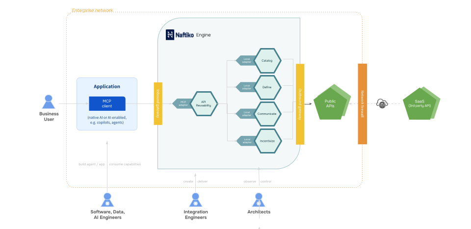

# Define, Report, and Incentivize API Reusability
This is an exploratory proof of concept to quantify what API reuse is across a catalog of APIs for a domain, report it to the rest of the company using existing services, and then incentivize API reuse in VSCode, encouraging developers to reuse existing patterns across the APIs they are producing and consuming.

API reusaability has been identified as a need across multiple conversations Naftiko is having with companies, and this repository is mean to explore what is possible across many different providers, helping better understand what API reuse means in way that others can use.

## APIs.json Index
This exploratory proof of concept uses [APIs.json](https://apisjson.org) as an index for all the working parts, providing a machine-reable artifact to automate the management and usage of this project

- [API Reusability](api-reusability.yml) - Mock an aggregate capability to help manage API reusability for a domain.
    - [Pull API Catalog](api-reusability-catalog.yml) - Mock an individual capability to establish an API catalog being assessed.
    - [Define API Reuse](api-reusability-definition.yml) - Mock an individual capability to define the state of API reuse.
    - [Communicate API Reuse](api-reusability-communicate.yml) - Mock an individual capability to communicate API reusability to different audiences.
    - [Incentivize API Reuse](api-reusability-incentivize.yml) - Mock an individual capability to incentivize the reuse of APIs during development.

As many of the steps as possible are executed and validated using Bruno, when an HTTP adapter is used, which was pushed further with this iteration, using Bruno pre and post request scripts to calculate the API reuse definition using API catalog data gathered.

## Image
This is an image of this aggregate events AI context capability to try and capture everything going on in the visual language we already use for our deck.

## Folders
This repository is currently broken down into the following folders that help support references made within the index, providing different layers using existing standards that our customers are using.

- **skills** - Using Agent Skills for any of the individual agents.
- **agent-2-agent** - Using A2A cards for any of the individual agents.
- **api-commons** - Using two API commons schema for plans and rate limits.
- **arazzo** - Using Arazzo for the oauth workflows and eventually events.
- **backstage** - Backstage software catalog system and APIs artifacts.
- **bruno** - Every HTTP adapter is setup and tested using Bruno client.
- **diagrams** - Produced a diagram to help illustrate how capability works.
- **model-context-protocol** - Generating MCP servers from each OpenAPI.
- **openapi** - Providing all of the OpenAPI needed for each HTTP adapter.
- **postman** - Alternatively using Postman instead of Bruno for a client.

In this exercise, a capabilities is just an aggregate of pointers to existing standards that provide abstractions for schema, interfaces, use cases, plans, rate limits, workflows, and governance, bundling up all the moving parts.

## Services
These are the different types of services in use across these capabilities, providing the different layers of integration needed to deliver this capbility.

- **Fleet** - The different services produced from this capability.
    - **API Reusability (HTTP)** - The aggregate HTTP JSON API produced.
    - **API Reusability (MCP)** - The aggregate HTTP MCP produced.
    - **API Reusability (A2A)** - The aggregate A2A produced.        
- **Rigging** - The different services needed to deliver business value.
    - **Amazon API Gateway (HTTP)** - Pulling of API paths.
    - **Amazon API Gateway (HTTP)** - Pulling of API schema
    - **GitHub Authentication (HTTP)** - Authenticating with GitHub.
    - **GitHub Repository OpenAPI Contents (HTTP)** - Pulling OpenAPI from GitHub.
    - **Notion Authentication (HTTP)** - Authenticating with Notion.
    - **Notion Page (HTTP)** - PUblishing a notion page.
    - **Splunk Authentication (HTTP)** - Authenticating with Splunk.
    - **Splunk HTTP Event Colelctor (HTTP)** - Publishing to Splunk dashboard.
- **Hull** - The different services needed to deliver operational value.
    - **New Relic Logs (HTTP)** - Logging of capbility activity via New Relic.
    - **New Relic Tracing (HTTP)** - Tracing of capbility activity via New Relic.
    - **Hashicorp Vault (HTTP)** - Management of secrets and keys.

## Tools
This capability possesses the common artifacts that other open-source tooling already speak, and can power the following tools:

- [**Bruno**](https://naftiko.github.io/technology/docs/tooling/bruno/) - Use Bruno collections and enviroments to work with each individual API used as part of this capbility.
- [**Microcks**](https://naftiko.github.io/technology/docs/tooling/microcks/) - Use Microcks for turning OpenAPI + Examples into sandboxes for all the API used in this collection.
- [**Backstage**](https://naftiko.github.io/technology/docs/tooling/backstage/) - Distribute capabilities and APIs used as part of the capabilities to any Backstage instance.

This capability will eventually run using the Naftiko Framework, but also simulatneoulsy work across these open-source tools.

## Contributions
I need your feedback. Please leave via [issues](https://github.com/naftiko-capabilities/api-reusability/issues) or email me at kinlane@naftiko.io, but also don't hesitate submitting pull requests to fix any problems encountered and leave feedback to help contribute to this work as it happening.
