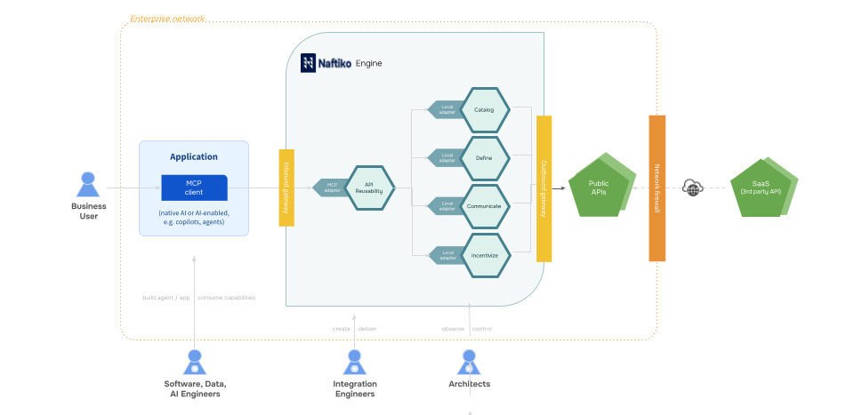

# Define, Report, and Incentivize API Reusability
This is an exploratory proof of concept to quantify what API reuse is across a catalog of APIs for a domain, report it to the rest of the company using existing services, and then incentivize API reuse in VSCode, encouraging developers to reuse existing patterns across the APIs they are producing and consuming.

API reusaability has been identified as a need across multiple conversations Naftiko is having with companies, and this repository is mean to explore what is possible across many different providers, helping better understand what API reuse means in way that others can use.

## Use Case
This is an implementation of the API reusable use cases for multiple pilot customers, leveraging the use case schema being developed to drive use case conversations, as well as how they are applied to each individual capability.

- [API Reusability](use-case/api-reusability.yml) - Defining and driving API reusability across a domain.

## Capabilities
This end-to-end use cases has six separate capabilities, providing five individual capabilities that can be applied individually, as well as an aggregate capability that brings them all together to provide the right-size context window for an MCP server incentivizing reuse in VSCode, while also updating leadership and other teams of the reuse.

- [API Reusability](capability-api-reusability.yml) - An aggregate capability to help manage API reusability for a domain.
    - [Establish API Catalog](capability-api-reusability-catalog.yml) - An individual capability to establish an API catalog being assessed.
    - [Define API Reuse](capability-api-reusability-definition.yml) - An individual capability to define the state of API reuse.
    - [Communicate API Reuse](capability-api-reusability-communicate.yml) - An individual capability to communicate API reusability to different audiences.
    - [Incentivize API Reuse](capability-api-reusability-incentivize.yml) - An individual capability to incentivize the reuse of APIs during development.

As many of the steps as possible are executed and validated using Bruno, when an HTTP adapter is used, which was pushed further with this iteration, using Bruno pre and post request scripts to calculate the API reuse definition using API catalog data gathered.

## Image
This is an image of this aggregate events AI context capability to try and capture everything going on in the visual language we already use for our deck.

## Folders
This repository is currently broken down into the following folders that help support references made within each capability, providing different layers of the capabilities using existing standards that our customers are using.

- **api-commons** - Using two API commons schema for plans and rate limits.
- **arazzo** - Using Arazzo for the oauth workflows of APIs being used.
- **bruno** - Every HTTP adapter is setup and tested using Bruno client.
- **diagrams** - Produced a diagram to help illustrate how capability works.
- **json-schema** - Localizing all the JSON schema needed to validate.
- **model-context-protocol** - Generating MCP servers from the OpenAPI.
- **openapi** - Providing all of the OpenAPI needed for each HTTP adapter.
- **spectral** - Providing all of the rules used to govern the capabilities.
- **use-case** - The use case being applied as part of this aggregate capability.
- **store** - Added to provide a place to cache responses and for requests.

In this exercise, a capabilities is just an aggregate of pointers to existing standards that provide abstractions for schema, interfaces, use cases, plans, rate limits, workflows, and governance, bundling up all the moving parts.

## Schemas
All of the JSON Schema are stored locally in this folder for development and learning purposes, but all schema will be centralized via the [schema repository](https://github.com/naftiko/schema) to ensure their reuse across each of the capabilities and use cases being developed as part of this work.

## Changes
I am rapidly iterating upon this set of capabilities as part of ongoing pilot customer conversations and GTM storytelling, helping evolve and strengthen our API reusability use case. To help capture the changes I will try to do bulk updates via commits and PRs, but will wrap with an issue for logging purposes.

- [API Reusability Change Log #1](https://github.com/naftiko-capabilities/api-reusability/issues/1)
- [API Reusability Thoughts #2](https://github.com/naftiko-capabilities/api-reusability/issues/2)
- [Complexity #3](https://github.com/naftiko-capabilities/api-reusability/issues/3)

## Contributions
I need your feedback. Please leave via [issues](https://github.com/naftiko-capabilities/api-reusability/issues) or in [Slack](https://naftiko.slack.com/archives/C09LLFZDLL9), but also don't hesitate submitting pull requests to fix any problems encountered and leave feedback to help contribute to this work as it happening.